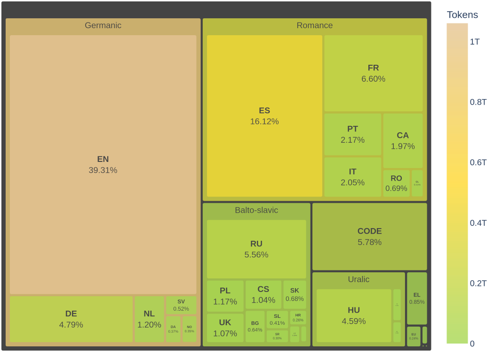

<style>
img[alt~="center"] {
  display: block;
  margin: 0 auto;
}
</style>
# 👥 IA com a Aliat Social?

- **Què és la intel·ligència artificial?**  

- **Beneficis de la IA en el Tercer Sector i Projectes Socials**  
  - Optimització de processos interns
  - Facilitació de la comunicació
  - Suport a la presa de decisions
  - Accessibilitat

- **Context de la causa catalana:**
  - Difusió de la llengua
  - Lluita contra la desinformació
  - Seguretat digital

<!--
**Notes:**  
- La Intel·ligència Artificial (IA) es refereix a sistemes informàtics capaços d'executar tasques que normalment requereixen intel·ligència humana, com ara el reconeixement de patrons, la presa de decisions o la generació de llenguatge. Des de les seves primeres investigacions als anys 50 fins als models actuals basats en xarxes neuronals, la IA ha evolucionat per convertir-se en una eina fonamental en múltiples sectors.
- Beneficis de la IA en el Tercer Sector i Projectes Socials
  - Optimització de processos interns: Automatització de tasques administratives com la gestió de bases de dades o el seguiment de projectes.
  - Facilitació de la comunicació: Creació de resums automàtics, assistència en la redacció de materials de sensibilització o gestió de xarxes socials.
  - Suport a la presa de decisions: Anàlisi de dades per a millorar estratègies de captació de fons o l’impacte de campanyes socials.
  - Accessibilitat: Aplicacions que milloren l’accés a la informació per a persones amb discapacitat visual o auditiva.

- Context de la causa catalana i la tecnologia com a eina estratègica
La IA pot jugar un paper clau en la defensa de drets socials i la promoció de la llengua i cultura catalana:

  - Preservació i difusió de la llengua: Sistemes de traducció automàtica i correcció en català.
  - Lluita contra la desinformació: Anàlisi de notícies falses i identificació d'informació manipulada.
  - Seguretat digital: Eines de protecció de dades i comunicació xifrada per garantir la privacitat de les entitats.
-->
---
# 🔍 Conceptes

**Què és la IA, l'aprenentatge automàtic i el *deep learning***  
  
**🚀 Aplicacions pràctiques en l’entitat:**  
  - Automatització de tasques administratives
  - Suport en la creació de continguts

<!--   
**Notes:**  
Concepte:
Cercles concentrics.

**Intel·ligència Artificial (IA)*: Fa referència a sistemes informàtics que poden realitzar tasques que normalment requereixen intel·ligència humana, com ara la presa de decisions, el reconeixement d'imatges o el processament del llenguatge.

**Aprenentatge automàtic (Machine Learning - ML)**: És una subcategoria de la IA on els sistemes aprenen patrons a partir de dades i fan prediccions sense ser explícitament programats. Un exemple pràctic podria ser un sistema que categoritza correus electrònics com a "importants" o "brossa" en funció dels missatges que l’usuari obre més sovint.

**Deep Learning**: És una branca de l’aprenentatge automàtic que utilitza xarxes neuronals artificials per processar grans volums de dades. Per exemple, el reconeixement facial en xarxes socials o la traducció automàtica en temps real.

** Exemple: 

Aplicacions pràctiques en una entitat de causa
Les entitats socials poden aprofitar la IA per millorar l'eficiència i optimitzar recursos en diferents àmbits:

**Automatització de tasques administratives**

- Eines d’IA poden ajudar a organitzar grans volums de dades sobre socis, donacions o projectes.
- Exemples: Sistemes que classifiquen documents automàticament o generen resums d'informes.
**Suport en la creació de continguts**

- Assistents d’IA poden suggerir textos per comunicats de premsa, publicacions a xarxes socials o butlletins informatius.
- Exemples: IA que analitza el sentiment de comentaris a xarxes socials per ajustar el to de la comunicació.

-->
---

# 🛠 Eines d'IA per a l'Entitat

  - **Plataformes conversacionals**: [ChatGPT](https://chatgpt.com), [Claude](https://claude.ai/), [Deepseek](https://chat.deepseek.com/) poden ajudar en la redacció de textos, resum de documents i suport en la presa de decisions.
  - **Reconeixement de veu i imatge**: [Whisper](https://github.com/openai/whisper) permet transcriure àudio a text amb gran precisió, [Otter.ia](https://otter.ai/) facilita la transcripció i resum de reunions. 
  - **Generació de continguts multimèdia**: [Canva amb IA](https://www.canva.com/es_es/generador-imagenes-ia/) crear dissenys automàticament, [Descript](https://web.descript.com/) facilita l'edició de vídeo i àudio amb IA. 

---

# 🧰 Recursos d'IA per a l'Entitat
- **Recursos formatius:**
  Cursos, webinars i manuals <sup>[1](https://www.youtube.com/playlist?list=PL6kQim6ljTJuDrH3yPIxfrbHRBm_o8kxB)</sup> per a la formació contínua, amb especial atenció a recursos en català.
- **Entorns de desenvolupament:**  
  Introducció a Python, biblioteques com TensorFlow o PyTorch i plataformes com Google Colab.


<!--
 Nosaltres ja fem servir la IA per analitzar XXSS i determinar si els missatges que fan refencia a nosaltres son positius o negatius i quina relevancia tenen.
-->
---
# 🎯 Casos pràctic d'altres entitats
- **Creu roja** sembla que utilitza IA per optimitzar la distribució d’ajuda humanitària en zones afectades per desastres naturals.[1](https://www2.cruzroja.es/ca/web/ahora/-/inteligencia-artificial-humanitaria-humanista) 
- **Amnistia Internacional** sembla que fa servir IA per detectar discursos d’odi i desinformació a les xarxes socials.
- **Banc dels Aliments** podrien estar provat models predictius per optimitzar la recollida i distribució d’aliments segons la demanda.


---
# 🦎 **Salamadra** un model del BSC

En el marc del projecte [ALIA](https://alia.gob.es/), s'han publicat uns [models de text](https://langtech-bsc.gitbook.io/alia-kit/modelos/modelos-de-texto). 

---

# ​🎬​ Enginyeria de Prompt 


**Què és un prompt?**
Un prompt és el conjunt d'instruccions o text que donem a una IA per obtenir una resposta o generació concreta. Pot ser una pregunta, una descripció, una ordre o fins i tot un conjunt de criteris detallats.
**Perquè és tant important?**
Qualitat de la resposta, Control i personalització , Eficàcia i temps, Etica i seguretat.
**Recurs**
[Guia d'Enginyeria de Prompts](https://www.promptingguide.ai/ca)

<!---
Notes:
🔹 Qualitat de la resposta → Un bon prompt guia la IA per donar respostes més precises i útils.
🔹 Control i personalització → Permet afinar els resultats segons necessitats específiques.
🔹 Eficàcia i temps → Evita respostes vagues i redueix la necessitat de repetir consultes.
🔹 Ètica i seguretat → Un prompt ben formulat pot evitar biaixos i respostes problemàtiques.

-->

---

# 🛠 Exemple enginyeria de prompt:

**Mala pràctica**
  *"Explica'm la història de Catalunya."*

**Bona pràctica**
  *"Fes-me un resum en 5 punts clau de la història de Catalunya amb èmfasi en la seva evolució política."*


---

# 🛡 Seguretat: Riscos en l’ús de la IA (I)
### Amenaces en la seguretat informàtica
  - 🥷 **Ciberatacs**: Els atacants poden introducir dades malicioses en l'entrenament del model (*Data Poisoning*). O la generació de continguts, amb tècniques com els "deepfakes", amb l'objectius de manipular l'opinio pública (*Spoofing*)
  - 🛠 **Sistemes vulnerables**: Algoritmes mal protegits o amb biaixos en les dades d'entrenament poden generar resultats esbiaixats o perjudicials.(*Biaixos en l'algoritmes*). Molt models funcionen com "caixes negres" on els porcessos interns son opacs (*Falta de transparència*)

<!--
**Notes**
  Exemples de:
  - **Data Poisoing**: En sistemes de reconeixement facial s'han detectat casos on petites modificacions en les imatges permeten que persones no autoritzades siguin reconegudes com a legítimes.
  - **Spoofing**: Febrer del 2024, a Hong Kong: un treballador d'una multinacional va pagar 25 milions de dòlars, tal com havia acordat en una reunió amb una altra empresa. Els assistents, però, eren deepfakes fets amb IA. Juny del 2023, als Estats Units: una mare va rebre una trucada. A l'altra banda del telèfon parlava la seva filla dient que l'havien segrestat [IA darrera del 40% de les ciberestafes](http://archive.today/qnsUs). Però no ho era, la seva veu l'havien generat amb IA. Els atacs utilitzant al IA han aumentat des del 2022 un 370%, i es calcula que  
  - **Biaixos en l'algoritmes**
  - **Falta de transparència** : Els models no oberts, po
Aquests exemples ressalten la importància de desenvolupar i implementar sistemes d'IA amb mesures robustes de seguretat i ètica, per tal de minimitzar riscos i protegir tant les dades com els usuaris.

-->

---
# 🛡 Seguretat: Riscos en l’ús (II)

### Dependència Excessiva i Deshumanització
- 📉 **Pèrdua de criteri humà**: Delegació excessiva de decisions crítiques a la IA.
- 🏥 **Impacte en sectors sensibles**: Errors en IA mèdica, judicial o financera poden tenir conseqüències greus.
- 🤖 **Reducció de la creativitat i pensament crític**: Automatització excessiva que limita la intervenció humana.

---

# 🛡 Seguretat: Riscos en l’ús (III)

### Impacte en la privacitat
- 📷 **Recollida massiva de dades**: IA que captura informació personal sense consentiment explícit.
- 🏠 **Seguiment constant**: Riscos en sistemes de videovigilància i rastreig de dades.
- 📡 **Identitat digital en perill**: Possibilitat de suplantació total de persones en entorns digitals.

<!---
**Notes:**  
- Il·lustra amb exemples pràctics el mal ús d'algoritmes en altres contextos.  
- Reforça la necessitat d'una gestió proactiva dels riscos, tant tecnològics com ètics.
-->
---
# 🛡 Seguretat: Riscos en l’ús (IV)

### Riscos en llengües minoritzades
- 🗣️ **Infrarepresentació en els models**: Si una llengua no és prou present en els corpus d’entrenament, els models poden generar respostes incoherents o incorrectes.
- 🏛️ **Pèrdua de diversitat lingüística**: Les llengües majoritàries en el corpus poden influir en la generació de text en llengües minoritzades, provocant errors gramaticals, lèxics o estructurals.

---
# 🛡 Seguretat: Riscos en l’ús (V)

### Invencions i Al·lucinacions de la IA
- 🌡**Temperatura mal ajustada**:  Un nivell de creativitat massa alt pot fer que la IA generi contingut menys fiable i més imaginatiu, augmentant el risc d’al·lucinacions.
- 🤯 **Falsedats amb to convincent**: La IA pot generar informació incorrecta amb un estil que sembla fiable.
- 📚 **Referències inventades**: Creació de cites acadèmiques, estudis o fets històrics inexistents.

---
# ✅ Bones Pràctiques
- 🏛 **Polítiques internes i codi ètic:**  
  - Definir valors i principis clars per a l’ús de la IA.  
  - Exemples de codis ètics d'[altres entitats](https://andorra-digital.com/images/pdf/recursos/codi%20etic%20IA.pdf), empreses.
- 🛡️ **Protocols de seguretat:**  
  - Auditoria regular dels sistemes d’IA.  
  - Protocols d’accés i control de dades.
- 🎓 **Formació contínua:**  
  - Tallers, sessions en seguretat informàtica i ètica de la IA.  
  - Col·laboració amb experts externs.

<!--
**Notes:**  
- Proposa la creació d’un comitè intern per supervisar l’ús de la IA.  
- Discutir la importància del manteniment constant i la revisió periòdica dels sistemes.

📌 Com mitigar-ho?
✔️ Exigir transparència en els models i bases de dades.
✔️ Aplicar auditories ètiques en el desenvolupament i ús d’IA.
✔️ Establir regulacions clares per a un ús responsable.
-->

---
# 🏛 Polítiques internes i codi ètic

Basat en [Catalonia.AI](https://politiquesdigitals.gencat.cat/ca/economia/catalonia-ai/) i marc regulatori de [la IA del parlament europeu](https://eur-lex.europa.eu/legal-content/ES/TXT/?uri=CELEX:32024R1689) hauriem de:
- **Integrar els principis ètic fonamentals**: Respecte per l'autonomia humana, prevenció de danys, equitat i explicabilitat.
- **Definir els requisits per a una IA fiable**: Supervisió humana, robustesa tècnica i seguretat, gestió de dades i privacitat, transparència, no discriminació, impacte social-ambiental i rendició de comptes.


<!--
**Notes**
Catalonia.AI => Estratègia d'Intel·ligència Artificial a Catalunya
### Principis ètics fonamentals
- Respecte per l’autonomia humana – Els sistemes d'IA han de potenciar les capacitats humanes sense coaccionar, enganyar o manipular les persones.
- Prevenció de danys – La IA ha de garantir la seguretat física i mental de les persones i evitar usos malintencionats.
-Equitat – S’ha de garantir una distribució justa dels beneficis de la IA i evitar biaixos discriminatoris.
- Explicabilitat – Els sistemes d'IA han de ser transparents i les seves decisions han de poder ser explicades a les persones afectades​Estrategia_IA_Catalunya….
###Requisits per a una IA fiable
- Supervisió humana: La IA ha de complementar la presa de decisions humana i assegurar mecanismes de supervisió.
- Robustesa tècnica i seguretat: Els sistemes han de ser segurs, fiables i protegits contra vulnerabilitats.
- Gestió de dades i privacitat: Protecció de la informació de les persones i garanties de qualitat i integritat de les dades.
- Transparència: Cal assegurar la traçabilitat de les dades i la identificació clara dels sistemes d'IA.
- Diversitat i no discriminació: Disseny inclusiu i eliminació de biaixos discriminatoris.
- Impacte social i ambiental: La IA ha de ser sostenible i fomentar el benestar social.
- Rendició de comptes: Han d’existir mecanismes per garantir la responsabilitat dels desenvolupadors i usuaris de la IA.

-->

---

# 📄 Problemes d'IA i el català

Com ja hem anat veient i atès que el seu corpus té molt poc català **No entenen bé el català** i **Barrejar-lo amb altres idiomes**.

*Exemple*
``` 
> Bon dia, com estàs?
"Estoy bien."
``` 


<!--
- **Recapitulació:**  
  Repassa els conceptes claus, eines, riscos i bones pràctiques presentats.
- **Línies d’acció immediates:**  
  - Propostes per iniciar projectes pilots amb la IA.  
  - Establir un pla de formació continuada i monitorització de la seguretat.
- **Foment de la col·laboració:**  
  - Treball conjunt amb altres entitats i experts per compartir experiències.  
  - Creació d'una xarxa de suport intern per a la gestió dels riscos.

**Notes:**  
- Enfatitza que la integració de la IA és un procés continu i d'adaptació constant.  
- Convida els assistents a aportar idees i comprometre's amb mesures de seguretat i ètica.
-->
---

# ⁉️ Preguntes i debat final

<!-- 
- Espai per a Q&A: Obrir un espai per respondre preguntes i aclarir dubtes.
- Dinàmica de debat: Proposa un debat sobre casos pràctics o dilemes ètics.

**Notes:**  
- Anima als participants a compartir les seves experiències o inquietuds.  
- Facilita un ambient de diàleg obert sobre com avançar de manera segura i responsable.
-->